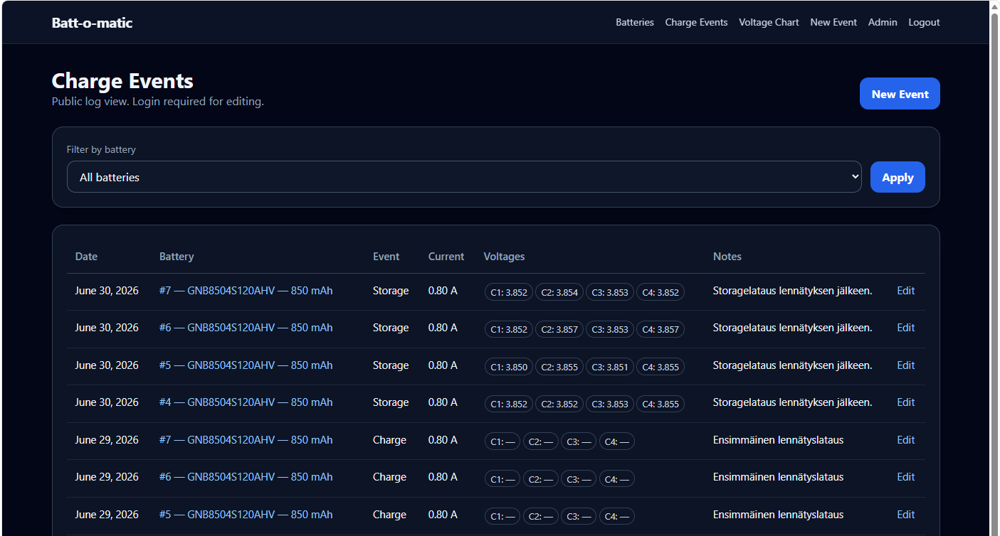
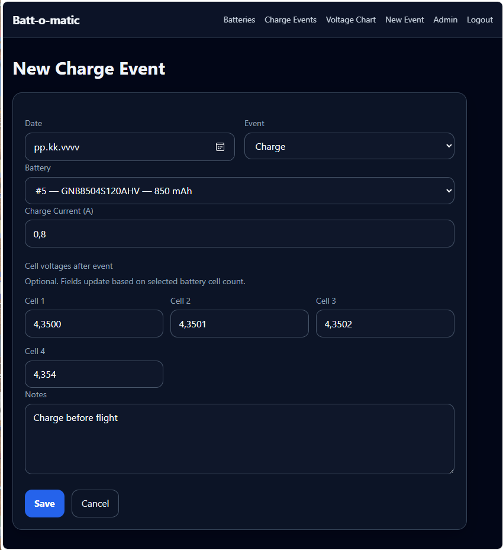
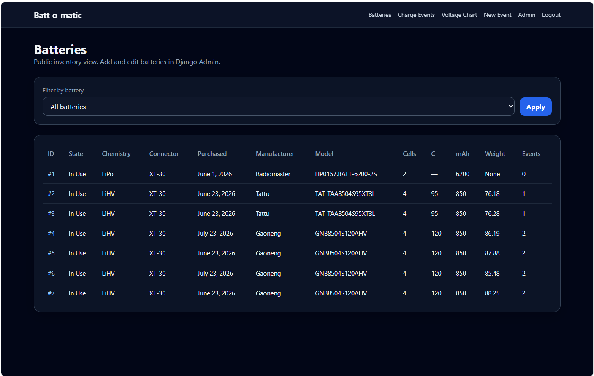
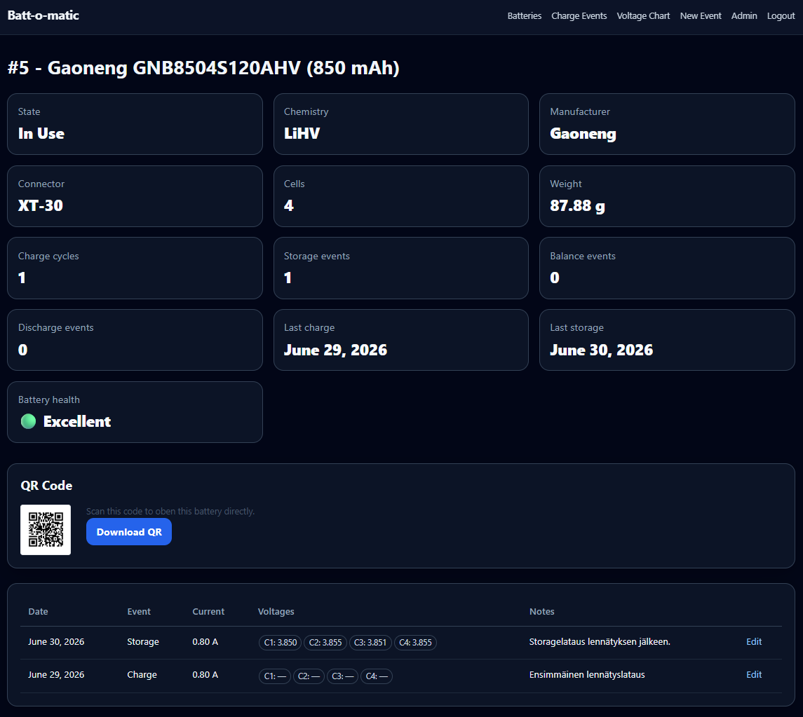
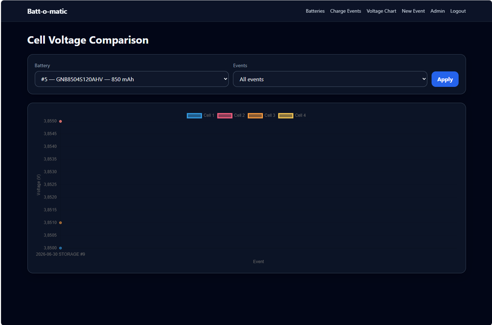

# Batt-o-matic 1.0

Batt-o-matic is a Django + MariaDB web app for maintaining a rechargeable battery inventory and charge log running on Docker container.

<table border='0'>
  <tr>
    <td></td>
    <td></td>
    <td></td>
    <td></td>
    <td></td>
  </tr>
</table>

## Current Features
- Battery inventory management
- Charge, Storage, Balance and Discharge event tracking
- Individual cell voltage recording
- Charge current logging
- Connector type support (XT30, XT60, JR/Futaba)
- Battery weight tracking
- Automatic charge cycle counting
- Battery Health indicator
- Cell voltage history graphs
- Event type filtering
- Battery statistics and summary view
- Modern responsive web interface (Tailwind CSS)
- Battery Management only with Django Admin this time
- Public read-only access with authenticated editing
- QR code generation for each battery
- Quick Charge workflow via QR code
  
## Technical details
- Docker-based deployment
- MariaDB backend
- Reverse proxy support (Nginx)
- Installer Script for fast testing / development

## Database models

- `Battery`
- `ChargeEvent`
- `CellVoltage`

The Django model names use normal Django naming, but the fields match the requested Batt-o-matic 1.0 schema.

## Prerequisites

- Knowledge of Linux and Docker environments and basic command line usage
- Docker and Docker Compose
- MariaDB container (Working example is on Docker-compose.example)
- A MariaDB database and user for Batt-o-matic

## Setup

You can use install.sh for semi-automated deployment. if your environment does not have any docker containers before.
I have tested it with Virtualbox Debian for several times and seems to work OK

Or you can do all manually.

### Manual setup

Let's assume some things for the directories:

- Clone this repository on your /home/git 
- Use /home/docker at your base directory

Install Docker (Debian here, so adjust accordinly)
```bash
curl -fsSL https://get.docker.com | sh
sudo usermod -aG docker $USER
```

Directory structure is something like this
```
/home/user/docker
  mariadb/
  battomatic/
.env
docker-compose.yml
dockerfile

```

```bash
cd
mkdir docker
cd git/battomatic
cp .env ~/docker/.env
cp docker-compose.yml ~/docker/docker-compose
cp dockerfile ~/docker/dockerfile
cp battomatic/ ~/docker/ -r

nano /opt/.env
```
- Set at least `MYSQL_ROOT_PASSWORD` and `TZ` on .env.
- Start the Mariadb and Adminer

```bash
docker compose up mariadb adminer -d
```
- Check that Mariadb container starts and running

```
docker compose logs mariadb --follow
```
- Try to login mariadb with adminer ```http://localhost:8080``` user is root
- If You get successfull access then let's make some database and user with proper password (Common finnish password is that Kissa123)
- Use that SQL command -link top left to enter following commands

```sql
CREATE DATABASE battomatic CHARACTER SET utf8mb4 COLLATE utf8mb4_general_ci;
CREATE USER 'battomatic'@'localhost' IDENTIFIED BY 'Kissa123';
CREATE USER 'battomatic'@'%' IDENTIFIED BY 'Kissa123';
GRANT ALL PRIVILEGES ON battomatic.* TO 'battomatic'@'%';
FLUSH PRIVILEGES;
```

- Look at battomatic\settings.py and setup the MariaDB part below the line 55 with correct values
- Adjust docker-compose paths suitable for your needs and make sure to take changes for dockerfile accordily
- Adjust also port if 3005 is not credible or sexy enough
- I have all docker containers on /opt and there's some permission shenanigans for that. It is safe to just run this in your home directory too.

Then try to build and start the app:

```bash
docker compose build batt-o-matic
docker compose up batt-o-matic -d
```
All looks good and build did not crash? Wow! Just Wow!

## Create admin user

```bash
docker compose exec batt-o-matic python manage.py createsuperuser
```
For common troubleshooting, you can Follow the container log. This assumes that build is successfull and container is running:

```bash
docker compose logs batt-o-matic --follow
```
Then open:

```text
http://localhost:3005/admin/
```
Add at least one battery before creating charge events.

## Normal workflow

1. Add batteries in Django Admin.
2. Browse public battery and event tables without logging in.
3. Login with a Django user to create or edit charge events.
4. Select a battery, then fill optional cell voltages and notes.
5. Review voltage trends from the Voltage Chart page.

## Development without Docker

```bash
python3 -m venv .venv
source .venv/bin/activate
pip install -r battomatic_requirements.txt
cp .env.example .env
python manage.py migrate
python manage.py runserver 0.0.0.0:3005
```

For local non-Docker development you still need MariaDB reachable with the `.env` settings.

## Notes for version 1.0

- Batteries are intentionally maintained through Django Admin only.
- Charge events are maintained through the normal UI.
- Public pages are read-only.
- Styling uses the Tailwind CDN for a simple starting point. For production hardening, replace it with a compiled Tailwind build step.

## DISCLAIMER

This code has been sparred with ChatGBT and published as is. I take no responsibility for any damages, wrong lottery numbers or anything else you might accuse me of (including the previous ice age!).

Taillight warranty is on!

Take care of yourself

## Licence

This project is licensed under the GNU General Public License v3.0 (GPL-3.0)
