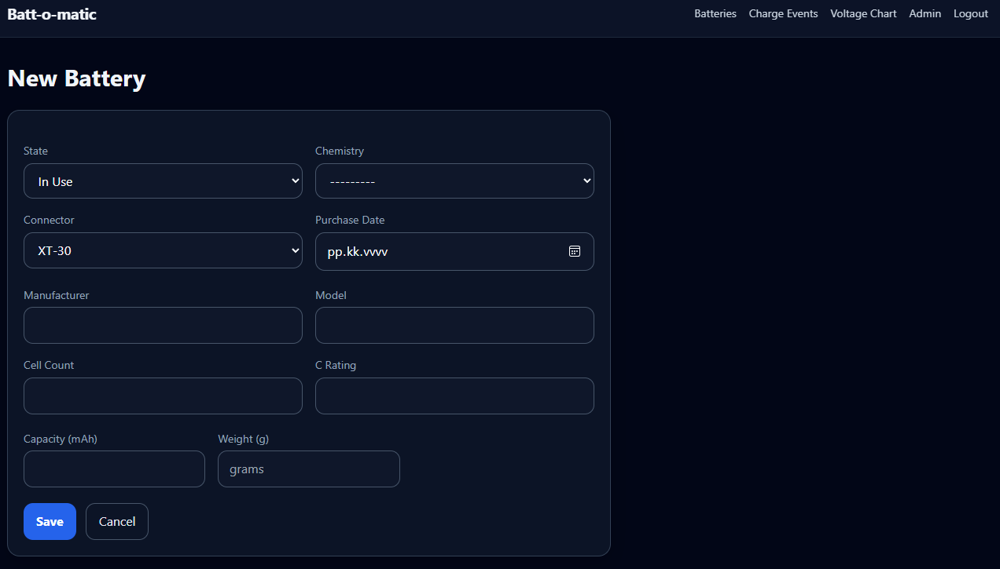
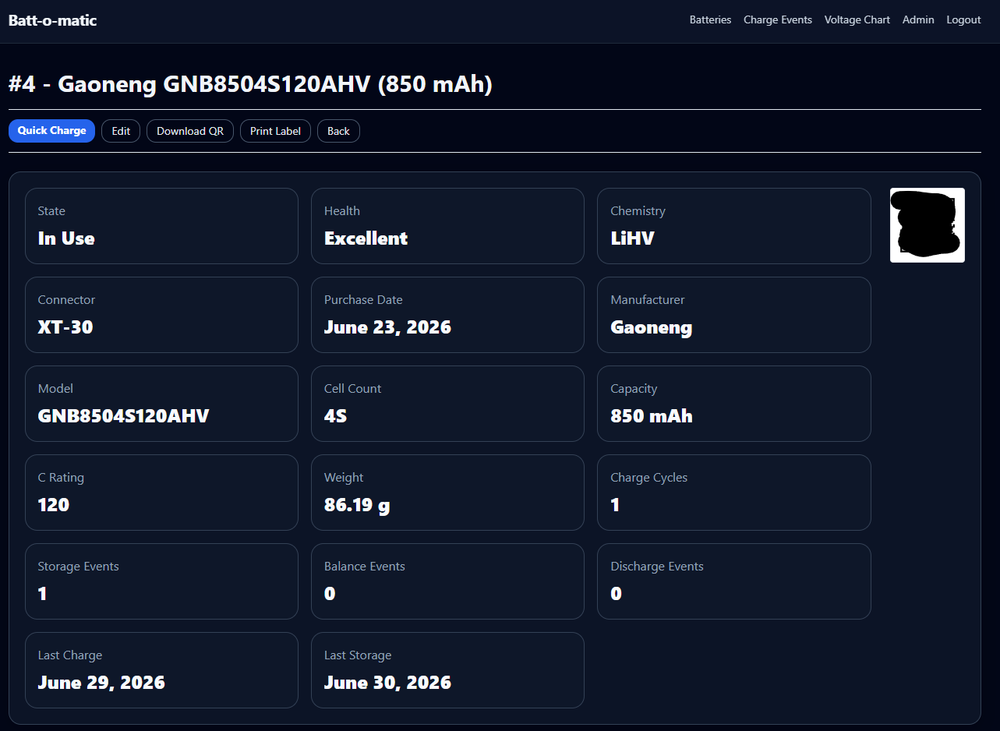
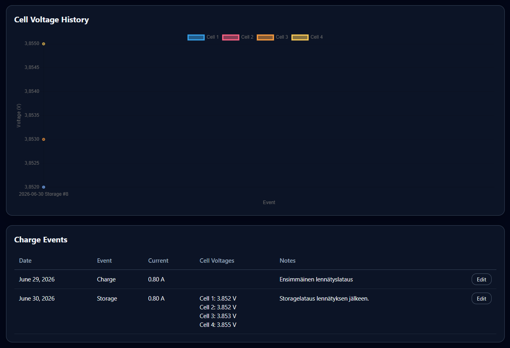

# Batt-o-matic 1.1

Batt-o-matic is a Django + MariaDB web app for maintaining a rechargeable battery inventory, charge log running and Edge-TX Flightlog Storage on Docker container.

<table border='0'>
  <tr>
    <td></td>
    <td></td>
    <td></td>
    <td></td>    
    <td></td>
    <td></td>
    <td></td>
  </tr>
</table>

## Current Features
- Battery inventory management
- Charge, Storage, Balance and Discharge event tracking
- Individual cell voltage recording
- Charge current logging
- Connector type support (XT30, XT60, JR/Futaba)
- Battery weight tracking
- Automatic charge cycle counting
- Battery Health indicator
- Cell voltage history graphs
- Event type filtering
- Battery statistics and summary view
- Modern responsive web interface (Tailwind CSS)
- Battery Management when logged
- Public read-only access with authenticated editing
- QR code generation for each battery
- Quick Charge workflow via QR sticker 
- Edge-TX log format importer for flight logs (Session->Battery>Flights)
- Unified Tailwind CSS throughout the project
  
## Technical details
- Docker-based deployment
- MariaDB backend
- Reverse proxy support (Nginx)
- Installer Script for fast testing / development

## For the next version
- Nothing in my mind this moment

## Database models

- `Battery`
- `ChargeEvent`
- `CellVoltage`

The Django model names use normal Django naming, but the fields match the requested Batt-o-matic 1.0 schema.

## Prerequisites

- Knowledge of Linux and Docker environments and basic command line usage
- Knowledge and some hint of common sense to not put his piece of s**t to your production environment!

## Setup

You can use install.sh for semi-automated deployment. if your environment does not have any docker containers before.
I have tested it with Virtualbox Debian Trixie for several times and seems to work OK (Network Mode is bridged)

install.sh ask you about:

- Directory to install (will make it)
- Mysql Root Passwd (plain text, for .env file, only field that you have to actually write something!)
- Battomatic DB Name
- Battomatic DB User
- Battomatic DB Pass

Or you Can Die like a Real Man and do all manually.

## Manual setup

Let's assume some things for the directories:

- Clone this repository on your /home/git 
- Use /home/docker at your base directory

Install Docker (Debian here, so adjust accordinly)
```bash
sudo apt-get install curl
curl -fsSL https://get.docker.com | sh
sudo usermod -aG docker $USER
```
- Relog/Reboot the machine for docker group rights 
- Directory structure is something like this
```
/home/user/docker
  mariadb/
  battomatic/
  nginx/
.env
docker-compose.yml
battomatic_dockerfile

```

```bash
cd
mkdir docker
cd git/battomatic
cp .env.template ~/docker/.env
cp docker-compose.yml.template ~/docker/docker-compose.yml
cp battomatic_dockerfile ~/docker/
cp battomatic/ ~/docker/ -r

nano /opt/.env

TIMEZONE=<your_timezone>
MYSQL_ROOT_PASSWORD=<mysql_root_pass_for_container>
DJANGO_BATTOMATIC_SECRET_KEY=<django secret key at least 64 characters a-zA-Z0-1!"#%&/() you understand, avoid $ at any secrets>
DJANGO_BATTOMATIC_SITE_URL=http://battomatic.yourhost.domain
DJANGO_BATTOMATIC_DEBUG=False
DJANGO_BATTOMATIC_ALLOWED_HOSTS=*
DJANGO_BATTOMATIC_CSRF_TRUSTED_ORIGINS=http://localhost:3005
DJANGO_BATTOMATIC_DB=battomatic
DJANGO_BATTOMATIC_DB_USER=battomatic
DJANGO_BATTOMATIC_DB_PASS=Kissa123
```
- Save the .env and edit docker-compose.yml next
- Change all ```${TARGET_DIR_ABS}``` lines suitable your paths and save the file.
- Pull and start the containers

```bash
docker compose up mariadb adminer nginx-proxy -d
```
- Check that Mariadb container starts and running

```
docker compose logs mariadb --follow
docker compose exec -it mariadb mariadb -u root -h mariadb --password=yourmysqrootpasswd
```
- Try also login mariadb with adminer ```http://localhost:8080``` user is root
- If You get successfull access then let's make some database and user with proper password (Common finnish password is that Kissa123)
- Use that SQL command -link top left to enter following commands

```sql
CREATE DATABASE battomatic CHARACTER SET utf8mb4 COLLATE utf8mb4_general_ci;
CREATE USER 'battomatic'@'%' IDENTIFIED BY 'Kissa123';
GRANT ALL PRIVILEGES ON battomatic.* TO 'battomatic'@'%';
FLUSH PRIVILEGES;
```

Then try to build and finally start the app:

```bash
docker compose build batt-o-matic
docker compose up batt-o-matic -d
```
All looks good and build did not crash? Wow! Just Wow!

## Make migrations and Create admin user

```bash
docker compose exec -it batt-o-matic python manage.py makemigrations
docker compose exec -it batt-o-matic python manage.py migrate
docker compose exec -it batt-o-matic python manage.py createsuperuser
```
For common troubleshooting, you can Follow the container log. This assumes that build is successfull and container is running:

```bash
docker compose logs batt-o-matic --follow
```
Then open:

```text
http://localhost:3005/admin/
```
Add at least one battery before creating charge events.

You need to add A-record for that battomatic.host.domain to your router DNS if you want to use that kind of address.

## Normal workflow

1. Add batteries in Django Admin.
2. Browse public battery and event tables without logging in.
3. Login with a Django user to create or edit charge events.
4. Select a battery, then fill optional cell voltages and notes.
5. Review voltage trends from the Voltage Chart page.
6. Print the Battery "Quick Charge" stickers and put them to your batteries.
7. Use QR-code on field with your phone if you have secure connection to your environment via Tailscale etc.


## DISCLAIMER

*DO NOT PUT THIS PIECE OF S**T DIRECTLY ON PUBLIC INTERNET! This code has been sparred with ChatGBT and published as is. I take no responsibility for any damages, wrong lottery numbers or anything else you might accuse me of (including the previous ice age!).

Taillight warranty is on!

Take care of yourself

## Licence

This project is licensed under the GNU General Public License v3.0 (GPL-3.0)
